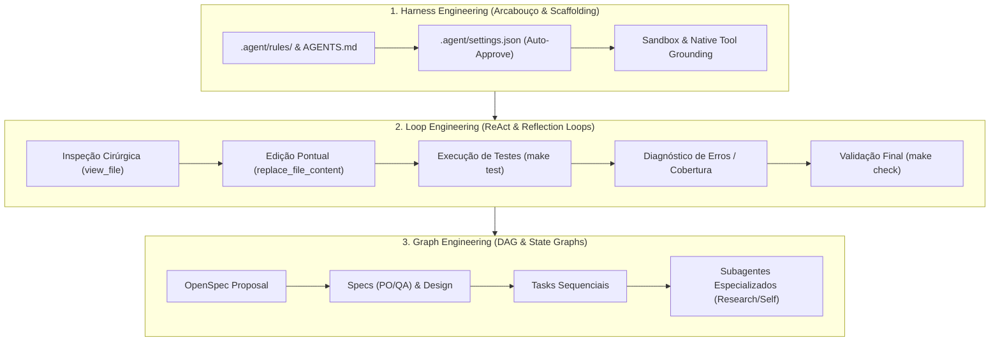

# Diretrizes de Operação e Engenharia de Agentes (Antigravity CLI)

Este documento estabelece o protocolo operacional, o arcabouço de governança de IA e as diretrizes arquiteturais para qualquer agente autônomo atuando no projeto **md_server**.

---

## 1. Prioridade Mandatória de Ferramentas Nativas (Native Tool Grounding)

Para garantir determinismo, estabilidade, economia de tokens e integridade no sistema de arquivos, o agente **DEVE utilizar estritamente as ferramentas nativas de I/O** disponíveis em sua interface, sendo expressamente vedado o uso de comandos de shell equivalentes via terminal:

| Operação | Ferramenta Nativa Mandatória | Proibido no Shell / Terminal |
| :--- | :--- | :--- |
| **Criar novos arquivos** | `write_to_file` | `cat << EOF`, `echo >`, `touch` |
| **Editar arquivos existentes** | `replace_file_content` | `sed`, `awk`, `cat >`, `patch` |
| **Ler / Inspecionar arquivos** | `view_file` (com `StartLine`/`EndLine`) | `cat`, `head`, `tail`, `more`, `less` |
| **Pesquisar código / texto** | `grep_search` (com filtros `Includes`) | `grep`, `rg`, `ag` |
| **Localizar arquivos por nome** | `find_by_name` (com `Pattern`/`Extensions`) | `find`, `ls -R`, `dir /s` |
| **Listar diretórios** | `list_dir` | `ls`, `dir`, `tree` |

### Uso Restrito do Terminal (`run_command`)
O terminal deve ser acionado **exclusivamente** para ferramentas de ciclo de vida, compilação, testes e automação:
- `make` (`make check`, `make test`, `make test-coverage`, `make lint`, `make fmt`, `make build`, `make build-all`).
- `go` (`go test`, `go mod tidy`, `go vet`).
- `git` (`git status`, `git checkout`, `git branch`, `git commit`, `git diff`).
- `openspec` (`openspec status`, `openspec instructions`, `openspec validate`, `openspec archive`).

---

## 2. Disciplinas de Engenharia de Agentes em Sistemas Compostos

1. **Harness Engineering**:
   - Arcabouço operacional composto por regras determinísticas ([`.agent/rules/`](file:///home/douglas/Workspace/gemini/markdown-server/.agent/rules/)), configurações de permissão pré-autorizada ([`.agent/settings.json`](file:///home/douglas/Workspace/gemini/markdown-server/.agent/settings.json)) e limites de sandbox para execução autônoma contínua sem prompts bloqueantes.
2. **Loop Engineering (ReAct / Reflection Loops)**:
   - Ciclo iterativo de auto-validação contínua:
     `Inspeção cirúrgica` $\rightarrow$ `Edição atômica` $\rightarrow$ `Execução de testes automatizados` $\rightarrow$ `Diagnóstico de falhas/cobertura` $\rightarrow$ `Validação no Quality Gate (make check)`.
3. **Graph Engineering (State Graphs & DAG de Raciocínio)**:
   - Modelagem do raciocínio e execução como um Grafo Direcionado Acíclico (DAG) de dependências topológicas.
   - Transições de estado determinísticas entre fases de especificação, implementação e validação.
   - Isolamento de pesquisas contextuais em subagentes dedicados (`research`) para preservação da janela de contexto do agente principal.

---

## 3. Economia Ativa de Tokens e Curação de Contexto

- **Leitura Cirúrgica**: Nunca inspecione arquivos inteiros se apenas um trecho for necessário. Utilize sempre os parâmetros `StartLine` e `EndLine` no `view_file`.
- **Edição Atômica**: Use `replace_file_content` para substituir blocos específicos de código, evitando sobreescrita total de arquivos já existentes.
- **Respostas Concisas**: Respostas devem ser objetivas, formatadas em Markdown rico com diagramas Mermaid quando aplicável e referências a arquivos no formato `[arquivo.ext](file:///caminho/arquivo.ext#L1-L30)`.
- **Não Duplicação**: NUNCA copie e cole no chat arquivos inteiros que já existem no disco. Apenas aponte para eles.

---

## 4. Pilares Arquiteturais e de Engenharia do md_server

1. **Clean Architecture (Go)**: Estrutura estrita com `cmd/md_server/` (Composition Root), `internal/core/domain/`, `internal/core/ports/`, `internal/core/services/` e `internal/adapters/`. Injeção de dependências manual via construtores e propagação obrigatória de `context.Context`.
2. **Versionamento Dinâmico (ldflags)**: `internal/version` com injeção de `Version`, `Commit` e `Date` no momento da compilação.
3. **Qualidade TDD/BDD e Barreira de Cobertura >= 80%**: Testes com subtestes declarativos (`Given / When / Then`), asserções via `testify` e validação automatizada por `scripts/coverage.sh`.
4. **Makefile Autodocumentado Universal**: Comandos padronizados (`make check`, `make test-coverage`, `make lint`, `make build-all`).
5. **Stack Tecnológica Enxuta**: `net/http` da biblioteca padrão, `goldmark` para parsing Markdown AST, `chroma` para syntax highlighting de código, Mermaid.js embutido no frontend (`//go:embed web/templates/* web/static/*`), e inicializador de navegador multiplataforma (Windows/Linux).
6. **Governança OpenSpec**: Alinhamento contínuo PO/QA com requisitos orientados ao usuário e cenários BDD/Gherkin estruturados (`#### Scenario:`, `- **GIVEN**`, `- **WHEN**`, `- **THEN**`).
7. **CI/CD & Release Multiplataforma**: Workflows no GitHub Actions para validação contínua e cross-compilação para Windows/AMD64 (`.zip` com `.exe`) e Linux/AMD64 (`.tar.gz`).
8. **Git Hygiene & Squash Merge**: Padrão Conventional Commits, branch isolada `feature/<change-name>`, nunca fazer merge na `main` sem permissão explícita do usuário, e execução de merge exclusivamente via **Squash Merge** para histórico linear e limpo.
