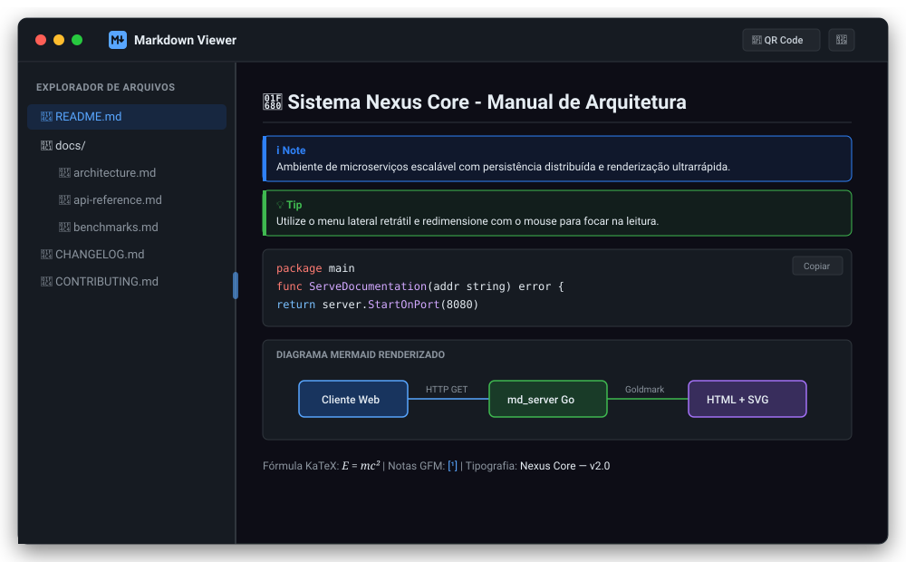
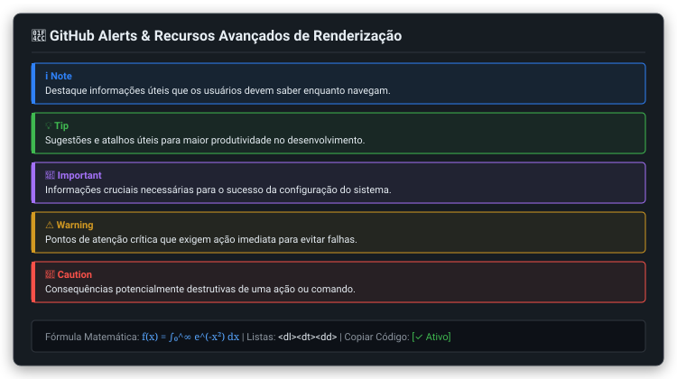
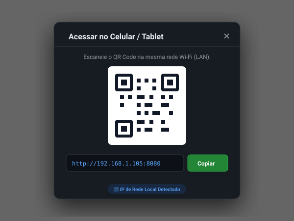

# Markdown Viewer (md_server) 📄⚡

[](https://golang.org)
[](.github/workflows/ci.yml)
[-brightgreen.svg)](scripts/coverage.sh)
[-orange.svg)](#-instalação-e-uso)
[](LICENSE)

**Markdown Viewer (`md_server`)** é um visualizador e servidor web local de arquivos Markdown ultrarrápido, minimalista e moderno, projetado para renderizar documentações locais com suporte completo a **GitHub Alerts**, diagramas **Mermaid**, destaque de sintaxe (**Chroma**), **Fórmulas Matemáticas LaTeX (KaTeX)**, **Notas de Rodapé (Footnotes GFM)**, **Botão de Cópia em Código**, menu lateral redimensionável e compartilhamento instantâneo via **QR Code de Rede Local (LAN)**.

Construído em **Go 1.22+** com **Clean Architecture (Ports & Adapters)**, gera um binário estático e independente sem nenhuma dependência externa de runtime (zero Node.js, zero Python, zero browsers headless no servidor).

---

## 🖼️ Prévias Visuais da Interface (Mockups Fictícios)

### 🌓 Visualização Principal (Dark Mode)


### 📌 GitHub Alerts & Recursos Avançados de Renderização


### 📱 Acesso Móvel e Compartilhamento via QR Code (LAN IP)
<p align="center">
  
</p>

---

## ✨ Principais Recursos e Plugins Suportados

| Recurso | Sintaxe / Descrição | Visual / Benefício |
| :--- | :--- | :--- |
| 🖱️ **Zero-Config & Duplo Clique** | Duplo clique no executável no Windows ou Linux | Abre servidor local seguro (`127.0.0.1`) e navegador instantaneamente |
| 📌 **GitHub Alerts (Admonitions)** | `> [!NOTE]`, `> [!TIP]`, `> [!IMPORTANT]`, `> [!WARNING]`, `> [!CAUTION]` | Caixas temáticas com ícones SVG oficiais e cores de destaque |
| 📊 **Diagramas Mermaid com Zoom/Pan** | ` ```mermaid ` com controles flutuantes (+ / - / ↺) | Diagramas vetoriais SVG interativos com Zoom suave e navegação por arrasto (*pan*) |
| 🎨 **Syntax Highlighting (Chroma)** | ` ```go `, ` ```python `, ` ```ts `, etc. | Dezenas de linguagens coloridas com alto contraste e legibilidade |
| 📋 **Botão de Cópia de Código** | Botão *Copiar* flutuante em blocos de código | Cópia com 1 clique para o clipboard com feedback "Copiado!" |
| 📐 **Fórmulas Matemáticas & LaTeX** | Inline `$E=mc^2$` e em bloco `$$\int_0^1 f(x)dx$$` | Renderização matemática de alta definição via KaTeX |
| 📝 **Notas de Rodapé (Footnotes)** | `Texto[^1]` e `[^1]: Definição` | Links sobrescritos com retorno suave `#fnref:1` e lista inferior |
| 📖 **Listas de Definição** | `Termo\n: Definição do termo` | Tags semânticas `<dl>`, `<dt>`, `<dd>` estilizadas |
| 🔤 **Tipografia Inteligente** | `---` $\rightarrow$ `—`, `--` $\rightarrow$ `–`, `...` $\rightarrow$ `…`, aspas curvas | Tipografia editorial moderna e refinada |
| ↔️ **Menu Lateral Redimensionável** | Barra divisória arrastável (`180px` a `600px`) | Largura personalizada persistida no `localStorage` do navegador |
| 🔒 **Segurança Local por Padrão** | Escuta padrão estrita em loopback (`127.0.0.1`) | Sem exposição na rede corporativa ou botões desnecessários |
| 📱 **QR Code Sob Demanda (`--lan`)** | Flag `--lan` habilita escuta `0.0.0.0` e QR Code | Acesso direto de smartphones e tablets na mesma rede Wi-Fi |
| 🌓 **Dark / Light Mode** | Alternador no cabeçalho com detecção de OS | Paletas de cores refinadas com alternância instantânea |
| 🧭 **Navegação Transparente** | Links relativos `[Guia](./docs/guia.md)` | Conversão automática em rotas web fluidas |
| 🛡️ **Proteção Path Traversal** | Sanitização e bloqueio de `..` escapes | Rejeição estrita com 403 Forbidden a tentativas fora da raiz |

---

## 🚀 Instalação e Uso

### 1. Download dos Binários Pré-Compilados
Baixe a versão mais recente para o seu sistema operacional na aba [Releases](../../releases):
- **Windows (amd64)**: `md_server-windows-amd64.zip` (contém `md_server.exe`)
- **Linux (amd64)**: `md_server-linux-amd64.tar.gz` (contém `md_server`)

### 2. Execução via Linha de Comando (CLI)

```bash
# Executa servindo a pasta atual em loopback seguro (127.0.0.1:8080) e abre o navegador
./md_server

# Habilita exposição na rede local (0.0.0.0) e ativa o botão de QR Code no cabeçalho
./md_server --lan

# Servindo uma pasta específica em outra porta sem abrir o navegador
./md_server --dir ./minha-documentacao --port 9090 --open=false

# Exibe a versão oficial e metadados de compilação
./md_server version
```

### Tabela de Parâmetros e Flags

| Flag | Shorthand | Padrão | Descrição |
| :--- | :--- | :--- | :--- |
| `--dir` | `-d` | `.` | Diretório raiz local contendo os arquivos Markdown a serem servidos |
| `--port` | `-p` | `8080` | Porta TCP para escuta HTTP (aloca porta livre se ocupada) |
| `--lan` | `-l` | `false` | Habilita escuta em todas as interfaces (`0.0.0.0`) e exibe o botão de QR Code |
| `--open` | `-o` | `true` | Dispara automaticamente a abertura da URL no navegador padrão |
| `--version` | `-v` | `false` | Exibe versão semântica, commit e data de compilação |

---

## 🏗️ Arquitetura de Software (Clean Architecture)

O código segue rigorosamente os princípios de **Clean Architecture (Ports & Adapters / Arquitetura Hexagonal)**:

```
md_server/
├── cmd/
│   └── md_server/           # Ponto de entrada (Composition Root e CLI Cobra)
├── internal/
│   ├── core/
│   │   ├── domain/          # Entidades de negócio (MarkdownDocument, FileNode, HealthStatus)
│   │   ├── ports/           # Interfaces formais de entrada e saída
│   │   └── services/        # Casos de uso (MarkdownService, HealthCheckService)
│   ├── adapters/
│   │   ├── in/              # Adaptadores de entrada (HTTP server, CLI Cobra, detecção de LAN IP)
│   │   └── out/             # Adaptadores de saída (FS scanner, Goldmark/Chroma renderer, Browser launcher)
│   ├── version/             # Injeção dinâmica de versão via ldflags
│   └── testutils/           # Mocks determinísticos e fixtures para testes
├── web/                     # Assets embutidos via //go:embed (Templates HTML, CSS, JS Mermaid/KaTeX)
├── docs/screenshots/        # Prévias e mockups visuais do produto
├── scripts/                 # Automação de cobertura (scripts/coverage.sh >= 80%)
└── .github/workflows/       # CI e Release Multiplataforma
```

---

## 🛠️ Guia do Desenvolvedor

### Pré-Requisitos
- Go 1.22 ou superior
- GNU Make (opcional, recomendado)

### Comandos do Makefile

```bash
# Exibe todos os comandos disponíveis
make help

# Instala ferramentas locais (golangci-lint, govulncheck)
make setup

# Executa todos os testes com verificação de cobertura (barreira >= 80%)
make test-coverage

# Valida o Quality Gate completo (formatação + testes)
make check

# Compila o binário de produção local
make build

# Compila a matriz multiplataforma oficial (Linux e Windows/AMD64)
make build-all
```

---

## 🌿 Boas Práticas e Governança Git

- **Branching Model**: Todo desenvolvimento de novas funcionalidades ocorre em branches isoladas `feature/<nome-da-mudança>`.
- **Conventional Commits**: Commits estruturados com tipos semânticos claros:
  - `feat(...)`: Novas funcionalidades e recursos.
  - `fix(...)`: Correções de bugs.
  - `style(...)`: Ajustes visuais, CSS e templates.
  - `docs(...)`: Documentações e README.
  - `test(...)`: Novos testes unitários ou de integração.
  - `refactor(...)`: Refatoração sem alteração de comportamento externo.
- **Squash Merge**: Merge na branch principal (`main`) executado exclusivamente via **Squash Merge** para assegurar um histórico linear e limpo.
- **Barreira de Cobertura**: Nenhum código é integrado sem atingir a barreira mandatória de cobertura global $\ge 80\%$.

---

## 📄 Licença

Distribuído sob a licença MIT. Consulte `LICENSE` para mais detalhes.
