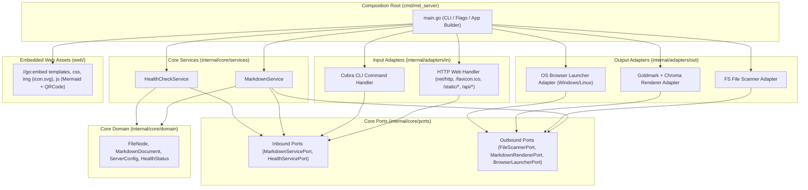
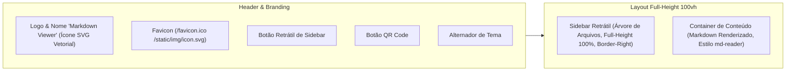

# Design Técnico: Fundação Arquitetural do md_server (Markdown Viewer)

## Context

O projeto `md_server` provê um servidor local e visualizador web sob a marca **Markdown Viewer**, renderizando arquivos Markdown com suporte a diagramas Mermaid, destaque de sintaxe, menu retrátil com altura total (100vh), interface minimalista inspirada no [md-reader](https://md-reader.github.io/), ícone estilizado no cabeçalho e na aba do navegador (Favicon), responsividade total em smartphones/tablets e compartilhamento via QR Code.

Consulte [proposal.md](file:///home/douglas/Workspace/gemini/markdown-server/openspec/changes/project-foundation/proposal.md) para a motivação de negócio e escopo detalhado, e [spec.md](file:///home/douglas/Workspace/gemini/markdown-server/openspec/changes/project-foundation/specs/project-foundation/spec.md) para os requisitos funcionais e cenários BDD formais.

---

## Goals / Non-Goals

### Goals
- Arquitetura limpa e desacoplada em Go 1.22+ (*Clean Architecture / Ports & Adapters*).
- Binário estático único sem dependências externas de runtime (HTML, CSS, SVG e JS embutidos via `//go:embed`).
- Identidade visual minimalista e moderna sob o nome **"Markdown Viewer"** com ícone vetorial SVG exclusivo e suporte a **Favicon** (`/favicon.ico`).
- Barra lateral retrátil (minimizar/expandir) com altura contínua de 100% da tela (`100vh`) e linha divisória sem cortes.
- Responsividade total para smartphones e tablets com menu gaveta (*drawer*) e overlay por toque.
- Botão de compartilhamento com modal integrado de **QR Code** para escaneamento rápido por dispositivos móveis.
- Processamento veloz de Markdown (GFM) com `goldmark`, highlight de código com `chroma/v2` e diagramas client-side com `mermaid.js`.
- Resolução e reescrita de links Markdown relativos (`./outro.md` para rotas web `/outro.md`).
- Suíte automatizada TDD/BDD com barreira de cobertura global >= 80%.

### Non-Goals
- Não prover edição de Markdown via interface web nesta fase (foco em visualização e leitura).
- Não utilizar frameworks web pesados no backend (manter `net/http` stdlib).
- Não depender de serviços externos de nuvem para gerar QR Codes ou renderizar Mermaid (geração 100% local e client-side).

---

## Architecture & Directory Layout

---

## Frontend Architecture & Visual Identity (Icon, Layout & Modal)

### 1. Ícone Vetorial e Favicon
- **Design do Ícone**: Arquivo `web/static/img/icon.svg` desenhado com formas geométricas limpas (documento estilizado com dobra e símbolo Markdown `M↓` em gradiente azul moderno).
- **Favicon**: O servidor HTTP mapeia explicitamente a rota `GET /favicon.ico` e o template HTML inclui `<link rel="icon" type="image/svg+xml" href="/static/img/icon.svg">`.

### 2. Barra Lateral Retrátil e Full-Height (100vh)
- **Altura Total**: O layout utiliza CSS Flexbox com `height: calc(100vh - var(--header-height))` e `background-color` preenchendo 100% da coluna esquerda, garantindo continuidade visual até o rodapé da tela.
- **Colapso/Expansão Suave**: A classe `.collapsed` no elemento `.app-sidebar` recolhe a largura com animação suave e persiste a preferência do usuário no `localStorage`.

### 3. Responsividade Mobile / Tablet (Drawer Navigation)
- Em telas com largura $\le 768px$:
  - A barra lateral transforma-se em gaveta móvel (*drawer*) com backdrop overlay.
  - O cabeçalho compacta botões e permite acesso rápido ao menu e ao QR Code.

### 4. Geração e Modal de QR Code
- Botão no cabeçalho dispara o modal com o QR Code gerado da URL atual para compartilhamento instantâneo com smartphones na rede local.

---

## Key Decisions & Alternatives Considered

1. **Ícone em SVG Puro vs PNG/ICO Rasterizado**
   - *Decisão*: Utilizar SVG vetorial de alta definição para o ícone da aplicação e servir como favicon moderno.
   - *Racional*: Nitidez perfeita em qualquer resolução (Retina / 4K / Mobile), tamanho mínimo em bytes (< 1KB) e facilidade de renderização inline no header.

2. **Geração de QR Code Client-Side**
   - *Decisão*: Geração no cliente via JavaScript/SVG.
   - *Racional*: Não sobrecarrega o servidor Go e funciona instantaneamente em qualquer rota ou âncora.

3. **Design Minimalista (md-reader reference)**
   - *Decisão*: Tipografia limpa, paleta suave, sem ruídos visuais, foco 100% no conteúdo.
