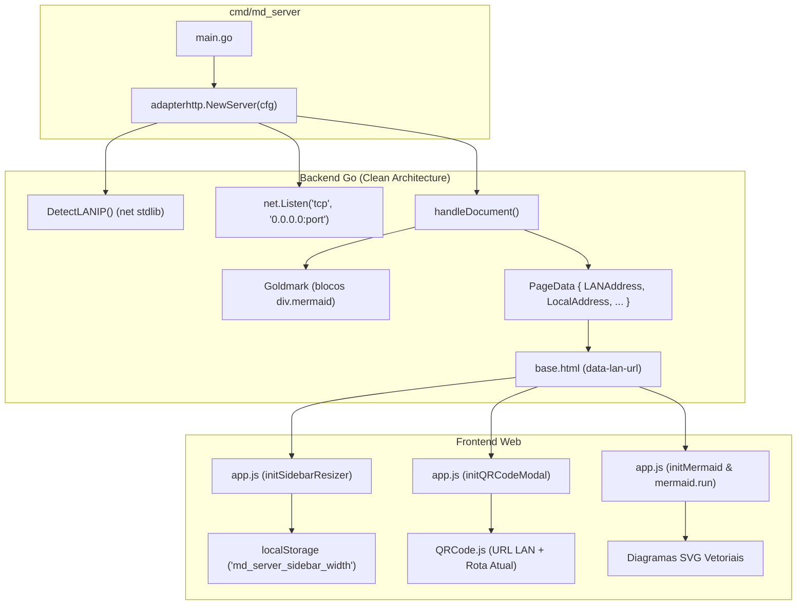

## Context

Consulte [proposal.md](file:///home/douglas/Workspace/gemini/markdown-server/openspec/changes/resizable-sidebar-lan-qrcode/proposal.md) para a motivação de negócio e escopo de alto nível.

O `md_server` adota Clean Architecture em Go com templates HTML/CSS/JS embutidos via `//go:embed`. Atualmente:
- O servidor HTTP escuta exclusivamente no endereço de loopback `127.0.0.1:<porta>`.
- O modal de QR Code no frontend monta a URL baseando-se estritamente em `window.location.href`, gerando `http://localhost:...` ou `http://127.0.0.1:...`, impossibilitando o acesso por smartphones e tablets na rede local.
- A barra lateral de navegação possui uma largura fixa definida em CSS (`--sidebar-width: 280px`), sem componente interativo de redimensionamento por arraste.
- A biblioteca Mermaid.js possui conflitos de inicialização assíncrona entre o loader `mermaid.min.js` e `app.js`, resultando em diagramas não renderizados como SVG.

## Goals / Non-Goals

**Goals:**
- Prover um divisor arrastável (*resizable splitter*) entre a barra lateral e o conteúdo principal, suportando ajuste contínuo de largura via mouse com limites seguros (180px a 600px / 50vw) e persistência no `localStorage`.
- Permitir que o servidor HTTP escute em todas as interfaces de rede (`0.0.0.0:<porta>`) para viabilizar conexões de outros dispositivos locais.
- Implementar mecanismo robusto de detecção de IP IPv4 não-loopback da máquina servidora em Go.
- Injetar o endereço de rede local (LAN) nos templates HTML e utilizá-lo na geração do QR Code e na cópia de links para compartilhamento rápido.
- Exibir claramente no console as URLs de acesso Local e de Rede Local (LAN).
- Garantir a renderização dinâmica e robusta de diagramas Mermaid em tempo real, com re-renderização na troca de tema (Dark/Light) e tratamento de erros de sintaxe.

**Non-Goals:**
- Suporte a tunelamento público (ngrok, cloudflare tunnels) ou autenticação/HTTPS na rede local.
- Redimensionamento por arraste em telas móveis (< 768px), onde a barra lateral atua como gaveta (*drawer overlay*).
- Gerenciamento dinâmico de múltiplas interfaces de rede complexas (VPNs, bridges virtuais); será selecionada a rota de saída principal.

## Decisions

### 1. Escuta em Todas as Interfaces (`0.0.0.0`) e Detecção de IP LAN
- **Decisão**: Alterar o `net.Listen` de `127.0.0.1:port` para `:port` / `0.0.0.0:port`. Implementar a função `DetectLANIP() string` no backend utilizando conexão UDP simulada sem envio de pacotes (`net.Dial("udp", "8.8.8.8:80")`), com fallback para iteração sobre `net.Interfaces()`.
- **Alternativas consideradas**:
  - *Manter 127.0.0.1 com flag opcional `--host`*: Rejeitado por prejudicar a experiência "Zero-Config" e duplo clique.
  - *Obter IP via WebRTC no browser*: Rejeitado por ser instável, bloqueado por políticas de privacidade dos navegadores e exigir código complexo no cliente.

### 2. Injeção de Dados de Rede no Frontend
- **Decisão**: Adicionar os campos `LANAddress` e `LocalAddress` na struct `PageData` no adaptador HTTP (`internal/adapters/in/http/handlers.go`), inserindo o atributo `data-lan-url` no elemento do modal de QR Code no `base.html`.
- **Alternativas consideradas**:
  - *Criar um endpoint REST dedicado (`/api/lan-info`)*: Rejeitado por gerar requisição HTTP extra e latência desnecessária no carregamento do modal.

### 3. Divisor Arrastável da Barra Lateral (Splitter Handle)
- **Decisão**: Inserir `

` entre `<aside id="app-sidebar">` e `<main class="app-content">`. O controle do estado de arraste será gerenciado via listeners de eventos `mousedown`, `mousemove` e `mouseup` no documento, ajustando a variável CSS `--sidebar-width` ou a propriedade `style.width` do elemento, e gravando no `localStorage` sob a chave `md_server_sidebar_width`.
- **Alternativas consideradas**:
  - *CSS puro com `resize: horizontal`*: Rejeitado pois a propriedade CSS `resize` não funciona adequadamente em layouts flexbox integrados a menus retráteis (`collapsed`) e não persiste o estado.

### 4. Renderização e Inicialização Confiável de Diagramas Mermaid
- **Decisão**: Padronizar o ciclo de vida de renderização do Mermaid no frontend unificando o script `mermaid.min.js` e a função `initMermaid()` no `app.js`. Salvar o código-fonte original de cada diagrama em atributo `data-original-code` para permitir re-renderizações ao alternar entre Dark/Light Mode. Executar a renderização via `mermaid.run()` ou `mermaid.init()`, capturando falhas de parsing para exibir um alerta visual elegante no lugar do diagrama.
- **Alternativas consideradas**:
  - *Renderizar Mermaid no backend via CLI externa/Chromium*: Rejeitado para preservar o binário único autônomo (zero dependências do sistema operacional).

### 5. Integração Arquitetural e Fluxo de Dados

## Risks / Trade-offs

- **[Risco] Múltiplos adaptadores de rede (ex: Docker, WSL, VirtualBox, Wi-Fi)**: O endereço IP detectado pode ser de uma interface virtual não roteável pelo celular.
  - **Mitigação**: O algoritmo de detecção utiliza rota padrão de saída via `net.Dial("udp", "8.8.8.8:80")` que resolve a interface padrão com gateway de internet, com filtragem explícita de interfaces de loopback.
- **[Risco] Interação entre Redimensionamento e Colapso da Barra Lateral**: Ao expandir uma barra lateral previamente colapsada, a largura personalizada pode ser perdida ou sobrescrita.
  - **Mitigação**: A classe CSS `.collapsed` define `width: 0 !important; min-width: 0 !important;`, e o JavaScript preserva a largura customizada na propriedade `style.width` ou CSS var, restaurando-a imediatamente quando a classe `.collapsed` for removida.
- **[Risco] Arraste sobre elementos iframes ou texto durante redimensionamento**: Seleção involuntária de texto na página durante o movimento rápido do mouse.
  - **Mitigação**: Ao iniciar o arraste (`mousedown`), adiciona-se uma classe `.resizing` ao elemento `document.body` com `user-select: none !important; cursor: col-resize !important;`, removendo-a no `mouseup`.
- **[Risco] Sintaxe Mermaid inválida em documento Markdown**: Um diagrama mal formatado pode interromper o script e falhar silenciosamente.
  - **Mitigação**: O executor encapsula `mermaid.run()` em `try/catch` / `.catch()`, preservando o código em bloco pré-formatado com aviso claro de erro de sintaxe.
