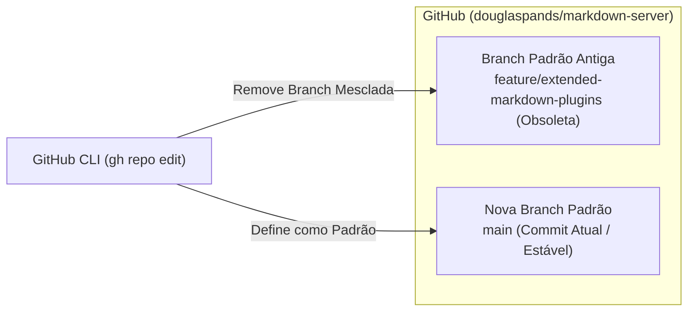

## Context

Consulte [`proposal.md`](file:///home/douglas/Workspace/gemini/markdown-server/openspec/changes/set-github-default-branch-main/proposal.md) para a motivação e contexto do repositório. O repositório remoto no GitHub (`douglaspands/markdown-server`) atualmente tem `feature/extended-markdown-plugins` como sua *default branch*. A branch canônica do projeto é a `main`, que reúne todo o histórico estável e as últimas entregas (incluindo o licenciamento MIT e plugins estendidos).

## Goals / Non-Goals

**Goals:**
- Configurar formalmente a branch `main` como a branch padrão (*default branch*) do repositório no GitHub via `gh repo edit --default-branch main`.
- Validar que a branch `main` remota (`origin/main`) e local estão sincronizadas e apontando para o commit mais recente.
- Remover branches remotas de feature já integradas (`feature/extended-markdown-plugins`, `feature/add-mit-license`), mantendo o repositório limpo.

**Non-Goals:**
- Alterar o código-fonte Go, testes unitários, portas, serviços ou assets embutidos.
- Realizar rebase destrutivo ou *force push* sobre a branch `main`.

## Decisions

### 1. Atualização da Branch Padrão via GitHub CLI
- **Decisão**: Executar o comando `gh repo edit --default-branch main` para alterar a referência da branch principal no GitHub.
- **Racional**: A CLI oficial do GitHub interage diretamente com a API v3/GraphQL do GitHub, aplicando a alteração de forma imediata e auditável.

### 2. Limpeza de Branches Remotas Integradas
- **Decisão**: Excluir referências remotas de branches que já foram totalmente incorporadas à `main` via squash merge.
- **Racional**: Evita confusão para contribuidores e ferramentas de automação/CI.

## Risks / Trade-offs

- **[Permissão da CLI no GitHub]** $\rightarrow$ *Mitigação*: A autenticação do `gh` na máquina possui escopo de escrita/administração no repositório.
- **[Abertura de PRs concorrentes]** $\rightarrow$ *Mitigação*: Com a `main` definida como padrão, qualquer novo PR criado no GitHub passará a mirar a `main` automaticamente.
