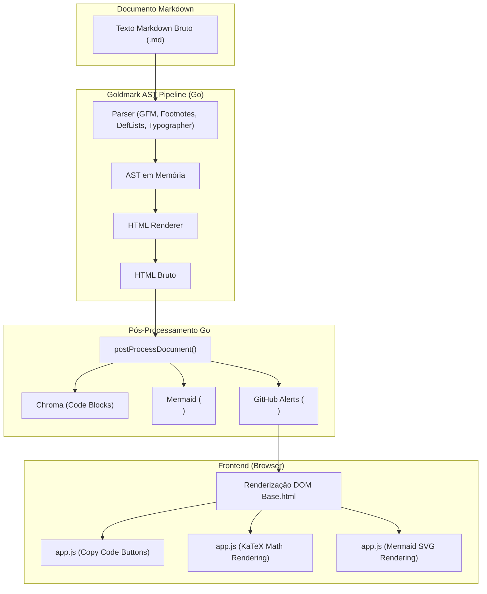

## Context

Consulte [proposal.md](file:///home/douglas/Workspace/gemini/markdown-server/openspec/changes/extended-markdown-plugins/proposal.md) para a motivação de negócio e escopo de alto nível.

O `md_server` utiliza o parser Goldmark em Go (`internal/adapters/out/renderer/goldmark.go`), reconhecido por sua extrema velocidade e extensibilidade baseada em AST. Atualmente, apenas o conjunto básico GFM (Tabelas, Strikethrough, Linkify, TaskLists), Mermaid e Chroma estão ativos. Esta mudança introduz extensões essenciais usadas no ecossistema GitHub sem adicionar gargalos de I/O ou latência de compilação.

## Goals / Non-Goals

**Goals:**
- Habilitar no Goldmark as extensões nativas `extension.Footnote`, `extension.DefinitionList` e `extension.Typographer`.
- Implementar suporte completo aos 5 tipos de GitHub Alerts (`[!NOTE]`, `[!TIP]`, `[!IMPORTANT]`, `[!WARNING]`, `[!CAUTION]`) com ícones vetoriais SVG e estilização CSS de alto contraste.
- Adicionar botão de cópia rápida (*Copy Code*) em todos os blocos de código com feedback visual.
- Prover suporte a equações matemáticas e LaTeX via KaTeX no frontend com zero impacto na renderização backend.
- Manter a barreira inegociável de cobertura de testes >= 80% e a performance instantânea do servidor.

**Non-Goals:**
- Suporte a plugins pesados que exijam binários externos (ex: Pandoc, Python-Markdown, Graphviz/dot).
- Execução de scripts arbitrários embutidos em arquivos Markdown.

## Decisions

### 1. Extensões Nativas no Goldmark Core
- **Decisão**: Configurar `extension.Footnote`, `extension.DefinitionList` e `extension.Typographer` diretamente no construtor `NewGoldmarkRenderer()`.
- **Justificativa**: São extensões oficiais do Goldmark, executadas no mesmo passo do AST em memória, gerando overhead inferior a 1 microssegundo por documento.

### 2. Suporte aos GitHub Alerts (Admonitions)
- **Decisão**: Implementar transformador/processador para identificar `<blockquote>
[!NOTE]
...</blockquote>` e convertê-los em `
...
` com os respectivos ícones SVG do GitHub Octicons e classes temáticas.
- **Alternativas consideradas**:
  - *Parser de terceiros com dependências extras*: Rejeitado para evitar inflar o `go.mod` e manter o código auditável e resiliente.

### 3. Botão de Cópia em Blocos de Código e KaTeX no Frontend
- **Decisão**: Implementar a injeção do botão de cópia via JavaScript (`app.js`) em elementos `.highlight` e `<pre><code>`, e carregar KaTeX de forma assíncrona para expressões matemáticas (`$...$` e `$$...$$`).
- **Justificativa**: Mantém o HTML gerado pelo Go limpo e semântico, delegando interatividade para o cliente.

### 4. Arquitetura e Pipeline de Renderização

### 5. Git Hygiene e Governança de Commits
- **Decisão**: Todo o desenvolvimento é isolado na branch `feature/extended-markdown-plugins`. Commits são estruturados seguindo rigorosamente a especificação **Conventional Commits** (`feat:`, `test:`, `style:`, `refactor:`).
- **Justificativa**: Garante rastreabilidade atômica, histórico linear e conformidade estrita com o protocolo de engenharia do projeto. Merge na `main` é realizado exclusivamente via **Squash Merge** com permissão explícita do usuário.

### 6. Documentação Visual e Mockups de Interface no README
- **Decisão**: Criar capturas/mockups vetoriais SVG e imagens ilustrativas em `docs/screenshots/` (ex: `preview-light.png`/`.svg`, `preview-dark.png`/`.svg`, `alerts-preview.png`, `mermaid-preview.png`, `qrcode-preview.png`) com dados e textos fictícios que demonstrem claramente o visual moderno do Markdown Viewer, incorporando-os no topo do `README.md`.
- **Justificativa**: Enriquece a apresentação visual do repositório, transmitindo profissionalismo imediato para novos usuários e contribuidores sem expor dados reais sensíveis.

### 7. Flag CLI `--lan` e Segurança de Exposição de Rede
- **Decisão**: Implementar a flag `--lan` / `-l` (tipo `bool`, padrão `false`) no CLI Cobra e na entidade `domain.Config`.
  - Quando `ExposeLAN == false` (comportamento padrão seguro): o servidor HTTP vincula o listener exclusivamente a `127.0.0.1:<port>`, o banner do terminal exibe apenas `http://localhost:<port>` e a flag `ShowQRCode` é definida como `false` em `PageData`, ocultando o botão e o modal de QR Code no template `base.html`.
  - Quando `ExposeLAN == true`: o servidor HTTP vincula o listener a `0.0.0.0:<port>`, detecta o IP da rede local via `DetectLANIP()`, exibe ambas as URLs (Local e LAN) no banner e habilita o botão de QR Code na barra superior da interface.
- **Justificativa**: Conformidade total com ambientes de trabalho corporativos e restrições de segurança que proíbem portas de desenvolvimento abertas para a rede externa por padrão.

### 8. Navegação Interativa e Zoom/Pan em Diagramas Mermaid
- **Decisão**: Implementar gerenciador interativo de Pan & Zoom nativo em Vanilla JS no `web/static/js/app.js` e estilização no `web/static/css/style.css`.
  - Cada container `.mermaid` recebe uma barra de ferramentas flutuante discreta no canto superior direito com ações:
    - Ampliar (`+` Zoom In).
    - Reduzir (`-` Zoom Out).
    - Resetar (`↺` Reset Zoom & Posição).
  - O diagrama SVG renderizado suporta:
    - Arrastar (*pan*) com o botão esquerdo do mouse ou touch com cursor interativo (`grab` / `grabbing`).
    - Zoom proporcional via scroll da roda do mouse (`wheel`) ou botões flutuantes.
    - Limites seguros de escala (mínimo `0.5x`, máximo `5.0x`) e transição CSS fluida.
- **Justificativa**: Diagramas extensos de sistemas complexos tornam-se facilmente legíveis e navegáveis diretamente na interface sem quebrar o layout da página.

### 9. Stack Tipográfica Otimizada para Markdown, Scripts e Código-fonte
- **Decisão**: Configurar em `web/static/css/style.css` a hierarquia de fontes de alto padrão da indústria recomendada para documentação técnica:
  - `--font-sans`: `-apple-system, BlinkMacSystemFont, "Segoe UI", "Noto Sans", Roboto, Helvetica, Arial, sans-serif, "Apple Color Emoji", "Segoe UI Emoji"`.
  - `--font-mono`: `"JetBrains Mono", "Fira Code", "Cascadia Code", "SF Mono", Consolas, "Roboto Mono", "Ubuntu Mono", "Liberation Mono", Menlo, Monaco, monospace`.
  - Otimizações de renderização:
    - `-webkit-font-smoothing: antialiased; -moz-osx-font-smoothing: grayscale;` no `body`.
    - `font-feature-settings: "liga" 1, "calt" 1;` em blocos de código (`.highlight`, `pre`, `code`) para ligaduras nítidas.
    - Preservação da renderização de diagramas Mermaid (`font-family: inherit`) e fórmulas KaTeX (`KaTeX_Main, Times New Roman, serif`).
- **Justificativa**: Garante legibilidade editorial de ponta em qualquer sistema operacional (macOS, Windows, Linux) sem overhead de download de fontes pesadas, mantendo o funcionamento 100% offline.

## Risks / Trade-offs

- **[Risco] Conflito entre símbolos de dólar (`$`) em textos comuns e fórmulas matemáticas**: Valores monetários normais podem ser interpretados acidentalmente como LaTeX.
  - **Mitigação**: O parser e o KaTeX auto-render consideram apenas delimitadores válidos `$ ... $` sem espaços nas extremidades ou blocos cercados `$$ ... $$`.
- **[Risco] Estilização de múltiplos alertas aninhados**: Blockquotes contendo outros blockquotes.
  - **Mitigação**: Regras CSS com isolamento de bordas e margens para `.markdown-alert` aninhadas.
